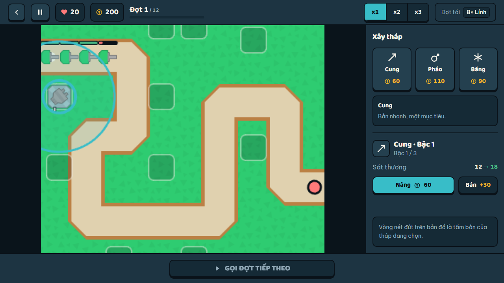

# 🛡️ Duck Defense — hold the road, let nothing through

[](https://github.com/LeVanAnhDuc/web-game-duck-defense/actions/workflows/ci.yml)
[](https://github.com/LeVanAnhDuc/web-game-duck-defense/actions/workflows/deploy.yml)
[](https://github.com/LeVanAnhDuc/web-game-duck-defense/releases)

A tower defense game that runs straight in the browser — no install, no account,
no backend. Progress lives in your own browser and nothing is ever sent anywhere.
The whole simulation is pure TypeScript with no browser dependency, so a full
12-wave battle runs headless in under 200ms and the game's balance is enforced by
a test rather than by hope.

**Play**: https://levananhduc.github.io/web-game-duck-defense/



## Features

- **The game itself**
  - Five hand-built maps, twelve to eighteen waves each, unlocked in order.
  - Five tower lines — fast single-target, splash cannon, area slow,
    wide-splash bolt and armour-piercing venom — with three upgrade levels each.
  - Three enemy types with their own speed, armour and bounty, including an
    armoured line that shrugs off everything except pierce damage.
  - Lose all your lives and the battle ends; clear the last wave and the map is
    yours.
- **Progress that respects your time**
  - A global upgrade tree in four branches, bought with `cores`.
  - A loss still pays out, and replaying a cleared map pays far less than a
    first clear — so grinding the easy map is never the optimal move.
  - Every map is winnable with **no upgrades at all**, and a test enforces it.
  - Picking a tower shows its range ring and its damage, range and fire rate on
    the board **before** you pay for it — winnable and learnable are not the
    same thing, and blind placement was losing people their first map.
    Nobody can get stuck behind a wall they have to grind through.
- **Plays the same everywhere**
  - Touch and mouse are equal citizens: nothing is reachable only by hover, and
    every hit area is at least 44px.
  - Real layouts at 375, 768, 1024 and 1440, in both orientations.
  - Battle speed x1, x2 or x3, plus pause. Speed runs more simulation ticks
    rather than scaling time, so the result is identical at any frame rate.
  - Every battle action is reachable by keyboard, and the focus ring is visible.
- **No sign-in, no server**
  - Progress goes to `localStorage` under one key. Change browser and it is
    gone — that is the price of the $0 hosting bill, and it is deliberate.
  - A save that cannot be read is **kept aside, never deleted**, and you are
    told what happened.
  - If the browser refuses to store anything, the game still plays and says so.
- **Vietnamese and English**, switched without a reload.

## Controls

| Action | Key / gesture |
| --- | --- |
| Select a slot or a tower | tap / click it |
| Build a tower | tap a slot, then tap a tower card — two steps, so a stray tap never spends gold |
| Pick a tower type first | `1` archer · `2` cannon · `3` frost |
| Build on the focused slot | `Tab` to a slot, then `Enter` |
| Call the next wave | `Space`, or the button |
| Clear the selection | `Esc` |
| Battle speed | the `x1 / x2 / x3` control |
| Pause | the pause button |

`Space` defers to whatever button has focus, so tabbing to **Upgrade** and
pressing space upgrades the tower — it does not call a wave.

## Commands

**Requires**: Node.js 22+ and npm. Not Yarn — three projects in this workspace
use Yarn, and running the wrong installer produces a different dependency tree.

```bash
npm ci             # install exactly what the lockfile says
npm run dev        # dev server
npm test           # 231 unit tests, no browser needed
npm run test:e2e   # 22 browser tests in Chromium
npm run build      # typecheck, then production build into dist/
npm run preview    # serve the production build
npm run lint       # ESLint
npm run typecheck  # tsc --noEmit
```

There are **no environment variables**. `.env.example` is empty on purpose and
says why.

## How it is put together

```
src/core/     pure TypeScript simulation — no Phaser, no React, no DOM
src/data/     balance tables and map definitions — numbers, no logic
src/game/     Phaser: draws the battle, reads canvas input, plays audio
src/ui/       React: every screen, the HUD, the upgrade tree
src/bridge/   the only place ui/ and game/ talk to each other
src/storage/  reads and writes the saved profile, defensively
src/i18n/     vi and en dictionaries
```

Three rules carry the design, and the first one carries the other two.

**`src/core/` does not know it is in a browser.** No Phaser, no React, no
`window`, no `localStorage`, and no `Math.random` — every random draw goes
through a seeded RNG held in the battle state. ESLint enforces this, because
without a mechanical check the rule holds only until the first person imports
Phaser into it and nothing goes red. What it buys: a whole battle runs in Node in
milliseconds, which is what makes the balance gate possible.
`tests/balance/maps-are-beatable.test.ts` plays every map twice — once with the
reference layout handed over free, and once with a simulated player who may only
spend the gold it actually earns — and fails if any map cannot be won with no
upgrades. That second player is the one that matters: it caught map 1, the
tutorial map, losing at wave 7.

**The simulation runs at a fixed 60Hz, decoupled from drawing.** x2 and x3 run
more ticks per frame; they never scale `dt`. A slow machine therefore reaches the
same outcome as a fast one, just less smoothly. Sprite positions interpolate
between ticks so a 120Hz display still looks smooth.

**React never renders per frame.** The battle publishes a reduced snapshot at
10Hz and React reads that; a browser test counts HUD updates to keep it honest.
Enemy health bars are drawn inside the canvas precisely because a 100ms lag would
be visible on them.

The things that break *silently* are listed in
[`docs/03-design/invariants.md`](docs/03-design/invariants.md) — read that before
changing anything in `src/core/`. The reasoning behind each choice, and the
alternatives that were rejected, is one ADR per decision in
[`docs/decisions/`](docs/decisions/).

## Art

Sprites are the [Kenney Tower Defense (top-down)
pack](https://kenney.nl/assets/tower-defense-top-down), CC0. The licence ships
alongside them at `public/assets/kenney/License.txt`.

The road is drawn as vectors rather than with the pack's road tiles, and that is
a constraint rather than a preference: those tiles are 64px grid pieces, while the
maps are free polylines at arbitrary coordinates. Using them would mean
re-authoring all five maps onto a grid, which changes every path length, which
means rebalancing all five. The road colours are sampled by script from the pack's
own dirt and sand tiles so the two do not clash.

## Releases and versioning

Three workflows, each with one job to do:

| Workflow | When | What it does |
| --- | --- | --- |
| `ci.yml` | every pull request | lint, typecheck, 231 unit tests, build, a hard bundle-size gate, 22 browser tests, and `npm audit` |
| `deploy.yml` | push to `main` | tests, build, publish to GitHub Pages |
| `release.yml` | push to `main` | works out the version, verifies again, tags and writes the notes |

The version comes from **Conventional Commit** subjects since the previous tag:
`feat:` bumps the minor, anything else bumps the patch, and `!` or a
`BREAKING CHANGE` footer bumps the major. On `0.x` a breaking change bumps the
minor instead, because nothing is stable before 1.0 — reaching `1.0.0` takes the
explicit `[release major]` marker, so it stays somebody's decision rather than a
side effect of a push.

What a commit author has to remember:

- Write Conventional Commit subjects. A subject that follows no convention still
  appears in the notes, under **Other** — notes that quietly drop commits are
  worse than untidy notes.
- `[skip release]` in the **subject** skips the release. Only the subject is
  read: commit bodies here run long and discuss releases, and reading markers
  from bodies would mean that writing about a major bump causes one.
- A `docs:` commit still produces a patch release. That is the design, not a bug.
  Add `[skip release]` if the same push already carries a `feat:`.

Both steps run locally, so neither has to be trusted blind:

```bash
yarn release:next     # which tag the next release would get
yarn release:notes    # what its notes would say
```

**One-time setup per repository:** enable Pages under Settings → Pages → Source →
*GitHub Actions*. The `enablement: true` flag in `deploy.yml` cannot do it —
`GITHUB_TOKEN` is not allowed to create a Pages site.

## Documentation

Everything lives in [`docs/`](docs/), and [`docs/README.md`](docs/README.md) is
the map: it lists every document, what question each answers, and how full it is.

The four worth knowing by name:

- [`docs/01-product/overview.md`](docs/01-product/overview.md) — what this is,
  and the Non-Goals that settle every scope argument.
- [`docs/03-design/invariants.md`](docs/03-design/invariants.md) — what breaks
  silently.
- [`docs/decisions/`](docs/decisions/) — one ADR per decision, with the rejected
  alternatives.
- [`docs/04-state/backlog.md`](docs/04-state/backlog.md) — what is left, and
  every shortcut taken on purpose. The balance numbers have survived four tuning
  passes against a simulated player but have never been played by a human; that
  is the top item there.
