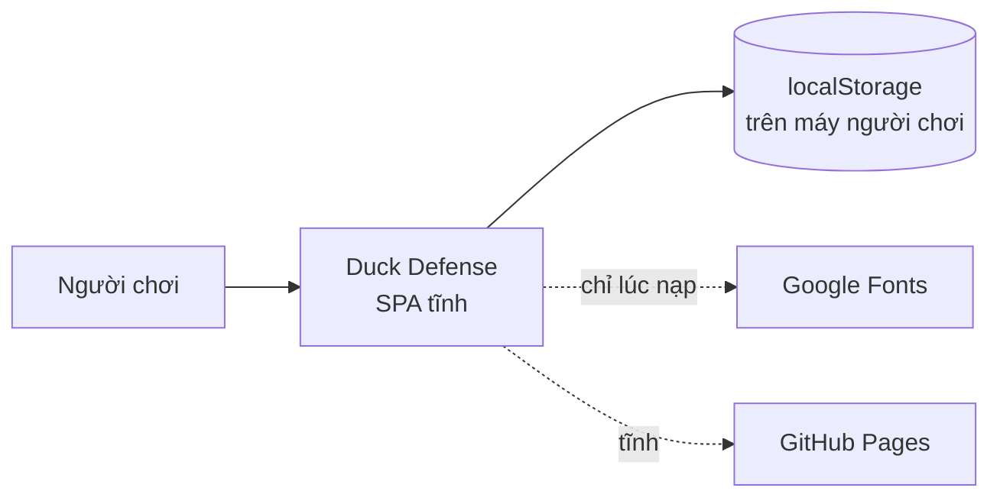
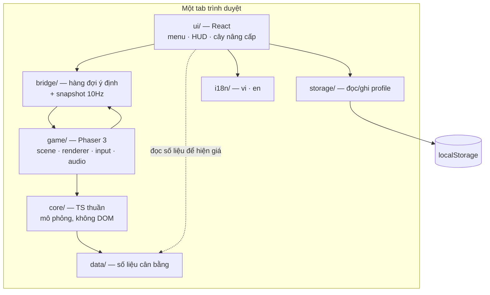

# Kiến trúc

> **Trả lời:** Hệ thống ghép lại thế nào, ranh giới giữa các phần ở đâu?
> **Trạng thái:** 🟢 đủ
> **Cập nhật:** 2026-09-08 · commit —
> **Cập nhật khi:** thêm/bỏ một module hoặc service · đổi cách hai module nói chuyện

<!-- CÁCH ĐIỀN
Mức độ: C4 mức 1 (context) và mức 2 (container). KHÔNG đi xuống class hay function —
đó là code, và code là bản mô tả chính xác nhất của chính nó.

Mục 3 (ranh giới module) là mục AI dùng nhiều nhất: nó quyết định code mới nên đặt
ở đâu. Viết mỗi module một dòng: tên · trách nhiệm một câu · được phép gọi ai.

Mục 5 chỉ ghi TÊN công nghệ + số ADR. LÝ DO chọn nằm trong ADR, không nằm đây —
nếu lý do bị chép vào đây thì hai bản sẽ lệch.

KHÔNG chứa: lý do chọn công nghệ (-> decisions/), bất biến (-> invariants.md),
schema chi tiết (-> file schema của ORM), danh sách chức năng (-> 02-requirements/scope.md).
-->

## 1. Context — hệ thống nằm giữa ai với ai



Không có server ứng dụng, không có database, không có hệ thống ngoài nào khác. Hai
mũi tên nét đứt là tải file tĩnh, không phải giao tiếp lúc chạy.

## 2. Container — hệ thống gồm những khối chạy được nào

Chỉ có **một** container: một SPA tĩnh chạy trong tab trình duyệt. Bên trong nó có
hai bề mặt vẽ khác nhau chạy song song trong cùng một tiến trình.



Mũi tên `UI --> BR --> GM` là **một chiều**: React không bao giờ gọi thẳng vào
`game/`, và `game/` không bao giờ gọi vào React.

## 3. Module và ranh giới

| Module | Trách nhiệm một câu | Được phép gọi | **Không** được gọi |
| --- | --- | --- | --- |
| `core/` | Chạy một tick mô phỏng: enemy tiến, tháp bắn, đạn trúng, kinh tế, thắng/thua | `data/` | Phaser · React · `window` · `document` · `localStorage` · `Math.random` |
| `data/` | Giữ số liệu cân bằng và định nghĩa bản đồ. **Không có logic** | — | tất cả |
| `game/` | Vẽ trận đấu, nạp asset, nhận input trên canvas, phát âm thanh | `core/` · `data/` · `bridge/` | React · `storage/` · `ui/` |
| `ui/` | Mọi màn hình và mọi chữ: menu, HUD, cây nâng cấp, cài đặt | `bridge/` · `storage/` · `i18n/` · `data/` | Phaser · `core/` · `game/` |
| `bridge/` | Chỗ **duy nhất** `ui/` và `game/` nói chuyện | `core/` (chỉ để lấy kiểu) | Phaser · React |
| `storage/` | Đọc/ghi profile, kiểm kiểu, migrate theo `schemaVersion` | — | `core/` · `game/` · `ui/` |
| `i18n/` | Từ điển chuỗi vi/en và hàm tra | — | tất cả |

Quy tắc gọn lại thành một câu, và đây là câu quyết định code mới đặt ở đâu:

> **`core/` không biết mình đang chạy trong trình duyệt.** Nếu một file trong `core/`
> cần `window`, `document`, `localStorage`, `Math.random`, Phaser hay React — thì nó
> không thuộc `core/`.

`ui/` được đọc `data/` là cố ý: HUD phải hiện giá xây tháp, và giá là dữ liệu tĩnh.
Đọc số thì được; chạy logic mô phỏng thì không.

## 4. Luồng dữ liệu của đường đi quan trọng nhất

**Một frame của trận đấu** — mọi thứ khác đi theo luồng này.

1. Phaser gọi `update(time, delta)`.
2. `game/` cộng `delta` vào một accumulator, rồi chạy `core.step(state, FIXED_DT)`
   **đúng `n` lần**, với `n = floor(accumulator / FIXED_DT)` nhân với hệ số tốc độ
   (x1 → 1, x2 → 2, x3 → 3). `FIXED_DT` là `1/60` giây.
3. Trước khi chạy tick, `game/` rút hết **ý định** đang xếp hàng trong `bridge/`
   (xây tháp, nâng, bán, đổi tốc độ, gọi đợt) và áp chúng vào state. Ý định được áp
   ở **ranh giới tick**, không phải giữa tick.
4. `core.step` chạy năm bước theo **thứ tự cố định** — xem `invariants.md`.
5. `game/` đọc state mới rồi đồng bộ sprite: sprite nào thiếu thì tạo, sprite nào
   không còn thực thể thì thu hồi về pool. Vị trí sprite nội suy giữa hai tick.
6. Mỗi 100ms, `game/` đẩy một **snapshot** rút gọn (mạng, tiền, đợt, thực thể đang
   chọn) sang `bridge/`; React đọc snapshot đó. **Không phải mỗi frame.**
7. Khi trận kết thúc, `game/` đẩy kết quả sang `bridge/`; `ui/` tính `cores` rồi gọi
   `storage/` ghi profile. **`core/` không bao giờ ghi gì.**

**Một trận chạy headless** đi đúng bước 4 và không đi bước nào khác — đó là lý do
bước 4 tách được:

```
runBattle(mapId, layout, upgrades, seed) -> { won, waveReached, ticks }
```

## 5. Tech stack

File này mang **phiên bản THẬT đang cài**, không mang con số viết trong ADR.
ADR ghi lại *quyết định* (dùng Phaser chứ không Pixi; dùng npm chứ không Yarn) và
là append-only, nên khi phiên bản nhảy thì chỗ cập nhật là bảng dưới đây.

| Lớp | Công nghệ | Phiên bản đang cài | Biện minh |
| --- | --- | --- | --- |
| Mô phỏng | TypeScript thuần, không thư viện | — | ADR-0003 |
| Vẽ trận đấu | Phaser | **3.90.0** | ADR-0002 |
| Vỏ giao diện | React | **19.2.8** | ADR-0002 |
| Cầu nối hai bên | hàng đợi ý định + snapshot 10Hz, tự viết | — | ADR-0004 |
| Kiểu dáng | Tailwind CSS, token từ `MASTER.md` | **4.3.3** | ADR-0006 |
| Lưu trữ | `localStorage`, một key, có `schemaVersion` | — | ADR-0005 |
| Art | Kenney Tower Defense pack (CC0) | — | ADR-0001 |
| Ngôn ngữ | TypeScript | **6.0.3** | ADR-0006 |
| Build | Vite | **8.2.2** | ADR-0006 |
| Quản lý gói | npm | — | ADR-0006 |
| Test lõi | Vitest | **5.0.0** | ADR-0006 |
| Test trên trình duyệt | Playwright | **1.63.0** | ADR-0006 |
| Hosting | GitHub Pages (tĩnh), `base: './'` | — | ADR-0005 · ADR-0007 |

**Hai chỗ lệch khỏi ADR, có chủ ý:** ADR-0002 và ADR-0006 nói "Phaser 3" và
"Vite 7". Phaser được **ghim lại `^3`** vì npm giải `^4.2.1` mà API Phaser 4 khác
đáng kể; Vite / Vitest / TypeScript thì giải lên cao hơn con số trong ADR. Quyết
định trong hai ADR đó không đổi.
